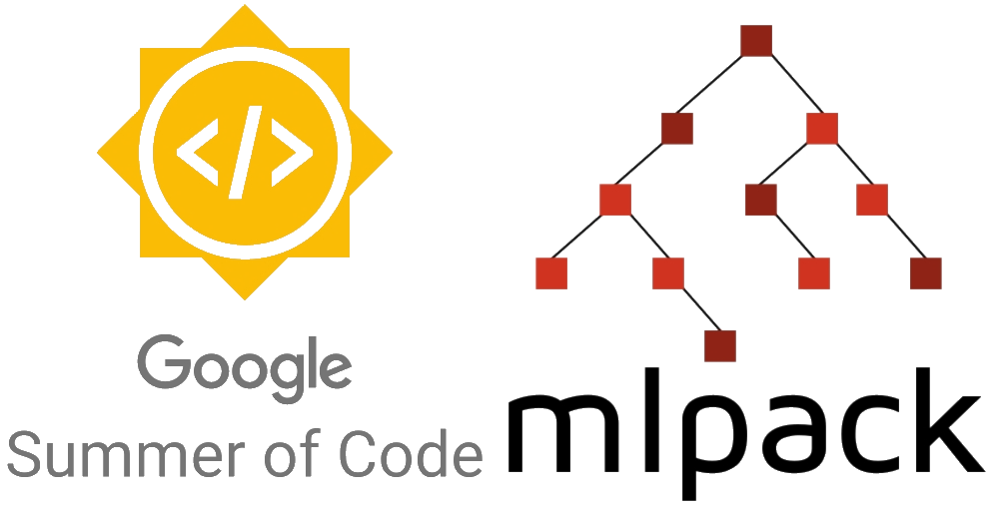
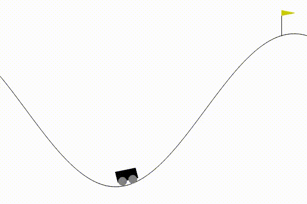

**Organization: [mlpack](https://github.com/mlpack)**

**Project: [Expanding Reinforcement Learning in mlpack: DDPG and TD3 Agents Integration](https://summerofcode.withgoogle.com/programs/2023/projects/mun1rpuI)**

**Mentors: [Marcus Edel](https://github.com/zoq) and [Shubham Agrawal](https://github.com/shubham1206agra)**


Here are the outcomes achieved by the agents I developed this summer, effectively addressing various classical reinforcement learning environments.
 | 
:-------------------------:|:-------------------------:
MountainCar with DDPG            |  Pendulum with TD3

## Introduction and Motivation
Reinforcement learning stands at the core of artificial intelligence, enabling machines to learn actions through interaction with their environments. This methodology has far-reaching applications, ranging from robotics to finance, offering solutions for complex real-world problems.

This Google Summer of Code project aimed to bolster mlpack's capabilities in reinforcement learning. This effort harnesses recent progress in reinforcement learning to create neural networks that can tackle practical challenges. The project focused on adding different reinforcement techniques.


## Project Objectives and Scope

The project's main objectives were to enhance mlpack's reinforcement learning abilities and incorporate modern techniques into its framework. The project aimed to achieve the following:

- Implement the Deep Deterministic Policy Gradient (DDPG) algorithm. [Lillicrap et al, 2015](https://arxiv.org/abs/1509.02971)
- Implement the Twin Delayed Deep Deterministic Policy Gradient (TD3) algorithm. [Fujimoto et al, 2018](https://arxiv.org/abs/1802.09477) 
- Incorporate Ornstein-Uhlenbeck noise (OU noise) and Gaussian noise for better exploration during training.
- Conduct thorough testing to ensure the reliability and effectiveness of the implemented algorithms.
- Provide comprehensive documentation for the newly added reinforcement learning agents and noise types.


## Challenges
During the project, several challenges were encountered and overcome to implement and integrate the agents into mlpack successfully:

- **Understanding Complex Concepts:** A significant challenge was comprehending the concepts presented in the original research papers of the agents. Addressing this required multiple readings and referencing other Python implementations to gain a clear understanding.
- **Debugging Complexity:** Debugging reinforcement learning agents proved to be difficult due to the complexity of the algorithms. Identifying the exact source of errors was challenging, and feedback from test cases often only indicated that an agent had failed, without specifying the underlying issue.
- **Updating Gymnasium Compatibility:** As Gym was deprecated and replaced by Gymnasium, integrating the reinforcement learning agents with Gymnasium environments required substantial effort. This involved updating the Python server to facilitate communication between mlpack and Gymnasium environments.

Despite encountering these challenges, the combined efforts of research, collaboration, and guidance from my mentor Marcus Edel played a crucial role in overcoming these obstacles.
## Implementation and Achievements
Here is an overview of the pull requests (PRs) I submitted and their current statuses:

|Pull Request Title|Status|
|---|---|
|Reinforcement Learning: Deep Deterministic Policy Gradient [#3494](https://github.com/mlpack/mlpack/pull/3494)|:purple_square: Merged|
|Reinforcement Learning: Ornstein-Uhlenbeck noise [#3499](https://github.com/mlpack/mlpack/pull/3499)|:purple_square: Merged|
|Reinforcement Learning: Twin Delayed Deep Deterministic Policy Gradient [#3512](https://github.com/mlpack/mlpack/pull/3512)|:purple_square: Merged|
|Reinforcement Learning: Gaussian noise [#3515](https://github.com/mlpack/mlpack/pull/3515)|:purple_square: Merged|
|Reinforcement Learning: Introducing Agent-Specific Tutorials [#3520](https://github.com/mlpack/mlpack/pull/3520)|:green_square: Open|
|Reinforcement Learning: Examples for DDPG and TD3 with Gymnasium Environments [#214](https://github.com/mlpack/examples/pull/214)|:green_square: Open|

Here is a code snippet that demonstrates the utilization of DDPG with Ornstein-Uhlenbeck noise.
```cpp
#include <mlpack.hpp>

using namespace mlpack;
using namespace ens;

int main()
{
  // Set up the training configuration.
  TrainingConfig config;
  config.StepSize() = 0.01;
  config.TargetNetworkSyncInterval() = 1;
  config.UpdateInterval() = 3;

  // Set up Actor network.
  FFN<EmptyLoss, GaussianInitialization>
      policyNetwork(EmptyLoss(), GaussianInitialization(0, 0.1));
  policyNetwork.Add(new Linear(128));
  policyNetwork.Add(new ReLU());
  policyNetwork.Add(new Linear(1));
  policyNetwork.Add(new TanH());

  // Set up Critic network.
  FFN<EmptyLoss, GaussianInitialization>
      qNetwork(EmptyLoss(), GaussianInitialization(0, 0.1));
  qNetwork.Add(new Linear(128));
  qNetwork.Add(new ReLU());
  qNetwork.Add(new Linear(1));

  // Set up the OUNoise parameters.
  int size = 1; 
  double mu = 0.0;
  double theta = 1.0; 
  double sigma = 0.1;  

  // Create an instance of the OUNoise class.
  OUNoise ouNoise(size, mu, theta, sigma);

  // Set up Deep Deterministic Policy Gradient agent.
  DDPG<Pendulum, decltype(qNetwork), decltype(policyNetwork), 
      OUNoise, AdamUpdate>
      agent(config, qNetwork, policyNetwork, ouNoise, replayMethod);
  
  // Code to set up training environment 
}
```

## Future Enhancements and Direction

Looking ahead, there are a few areas that could further enhance the project:
- **Training on MoJoCo Control Environments**
- **Abstraction of Agents:** Abstracting the agents to allow for object construction without the need to specify every parameter would improve usability and make the integration of new agents more straightforward.
## Acknowledgments
I extend my gratitude to my mentors, [Marcus Edel](https://github.com/zoq), and [Shubham Agrawal](https://github.com/shubham1206agra), for their valuable guidance and support throughout this project. Their insights and assistance have been vital in navigating the challenges and achieving the project's objectives. 

Additionally, I would like to express my appreciation to Google for providing the opportunity to contribute to open-source software through the Google Summer of Code program.

## Ways to reach me
<p align="center">
  <a href="mailto:tareknaser360@gmail.com?subject = Hello from your GitHub README&body = Message"></a>
  <a href="https://www.linkedin.com/in/tareknasser360/"></a>
</p>
