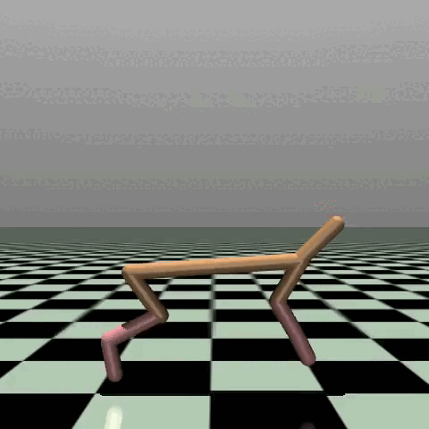

# `HalfCheetah-v4` Environment with `mlpack` TD3

  

In this project, we trained a reinforcement learning agent to solve the [`HalfCheetah-v4`](https://gymnasium.farama.org/environments/mujoco/half_cheetah/) environment using mlpack's Twin Delayed Deep Deterministic Policy Gradient (TD3) implementation. The goal was to train the agent to perform efficiently in a complex control task.

## Environment

We used the OpenAI Gymnasium Toolkit's GUI interface for training and testing our agent. This interface is provided through a distributed infrastructure (TCP API), which enables us to interact with the environment. You can find more details about this infrastructure [here](https://github.com/zoq/gym_tcp_api).

## Video

The full video output of the trained agent solving the environment can be found [here](half_cheetah.gif)

## Code

The code used to train the agent can be found [here](/src/half_cheetah/half_cheetah_td3/).

## Hyperparameters

Here are the hyperparameters used for training the TD3 agent:

| Hyperparameter                    | Value          |
|-----------------------------------|----------------|
| Training Steps                    | 150,000        |
| Step Size                         | 7e-4           |
| Target Network Sync Interval      | 1              |
| Exploration Steps                 | 10,000         |
| Discount                          | 0.99           |
| Update Interval                   | 1              |
| Replay Buffer Size                | 1,000,000      |
